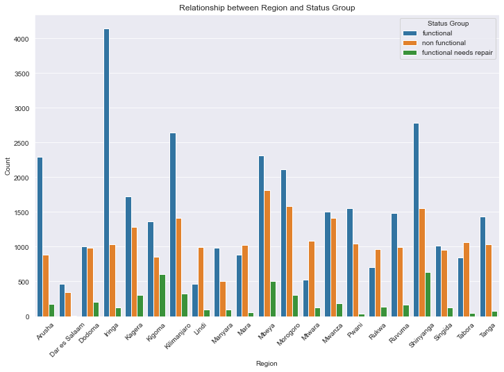
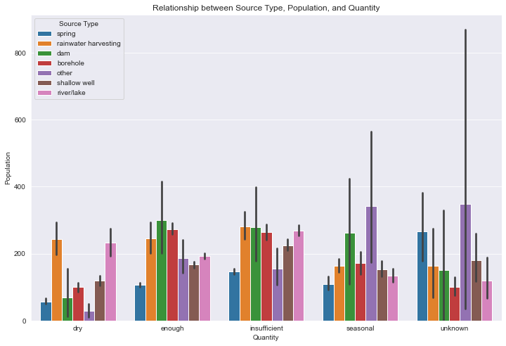

# Tanzania Water Wells

# Business Understanding
Tanzania is known to be a well developing nation with a population of approximaltely 60 milion people.Millions of people in Tanzania, struggle to get clean water and are forced to cover very long distances in search of clean water. Wells are the main source of water for most Tanzanians,however many are broken or in bad shape. This shortage of water is a major issue as water is an essential in various sectors,leading to poor health,slow economic growth and hindered productivity.
This projects with the use of machine learning tools aims at identifying why some wells fail,predict whether the new wells will work . 

## Problem Statement
Water shortage is a crucial problem in Tanzania and this arises majorly from the maintenance of wells.Maintaning these water sources is also a challenge maybe because of water quality,geographical location,infrastracture upkeep and many other factors. Some are non-functonal while others are partially functional.This may limit the local citizens from accessing clean water.
Challenges faced include: Health and sanitation issues,Poor economic growth and hindered productivity.

Our project here aims to help those who are in charge of water be it governmeantal ,non-governmental organisations and maybe policymakers to make improved or better decisions that would help in improvement of the functionality and maintenance of water wells in the country.

# Objectives
 1. determine if functionality of the wells varies on quantity.
2. Identify the most popular water point type.
3. Determine whether the status of functionality is related to the payment type.
##  Main objective

Build a classifier model that will determine functionality of waterwells accurately.

## Data Understanding
Source of data : Https://www.drivendataorg/competitions/7/pump-it-up-data-mining-the-water-table/data

Has 41 columns and 59400 entries
Our csvs are: 1. Test Set Values
2. Training Set Labels
3. Training Set Values

 ## Data preparation 
 Checked for duplicates,dropped duplicates,checked missing values,replaced missing values with mode,dropped columns.

# Data Analysis
Delved into intricate web of factors related to water functionality in Tanzania through EDA(Exploratory Data Analysis.)
This section was divided into :

1. Univariate 
2. Bivariate
3. Multivariate

 
 Shows relationship between region and the status of the wells.

This shows the relationship between the source_type, Population and the quantity.

## Modeling
Used the models:
1. KNearest 
2. DecisionTree
3. Logistic Regression
4. Random Trees

The above models seemed to be overfitting and underfitting.
Gradient Boosting was the best model compared to the others as it showed balancing. It had a training accuracy of 63.02%.

# Findings

1. Iringa is observed to be the region with the  highest number of functional water points.
2. Many functional water points seem to be providing insufficent amounts of water.
3. A lot of non-functional water sources are not paid for.
4. Factors that contribute functionality of the water sources include:Region, source type and water quality.
5. The functional water points wer the most populated.
6. Many wells are found in areas that are highly populated.

# Recommendations.
1. The government of Tanzania and other top financiers being the main funders should be approached to fund for repairs and also add more water wells.
2. For the people to enjoy or have water the government should impose a rule where it will be mandatory for them to pay since it has being observed that there are many functional where they are paid for.